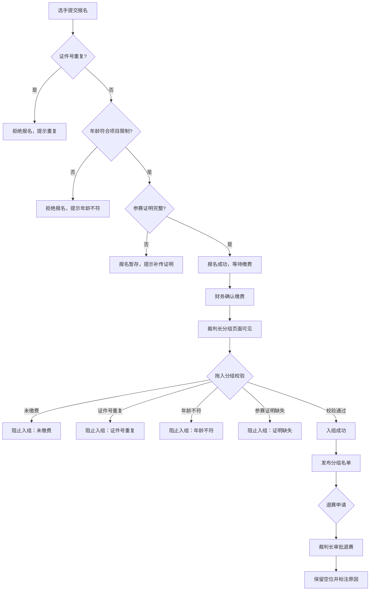

## 1. 产品概述

体育赛事报名分组管理系统，贯通选手报名、财务缴费和裁判长分组三大环节，确保参赛资格合规、缴费到位后方可入组，并支持发布后退赛流程。面向赛事运营团队（选手、财务、裁判长、管理员）提供一站式赛事管理能力。

## 2. 核心功能

### 2.1 用户角色

| 角色 | 注册方式 | 核心权限 |
|------|----------|----------|
| 选手 | 自助报名 | 提交/修改报名信息、查看分组名单 |
| 财务 | 管理员分配 | 确认缴费、查看缴费记录 |
| 裁判长 | 管理员分配 | 拖拽分组、发布名单、处理退赛 |
| 管理员 | 系统预设 | 管理赛事项目、年龄组规则、用户权限 |

### 2.2 功能模块

1. **报名页**：选手填写项目、证件号、年龄组、紧急联系人、参赛证明上传
2. **缴费页**：财务查看待缴费列表，确认缴费状态
3. **分组页**：裁判长拖拽已缴费选手入组，实时校验资格
4. **名单页**：查看已发布分组名单，支持导出
5. **退赛页**：发布后选手退赛处理，保留空位说明

### 2.3 页面详情

| 页面名称 | 模块名称 | 功能描述 |
|----------|----------|----------|
| 报名页 | 报名表单 | 项目选择、证件号输入（重复校验）、年龄组自动匹配、紧急联系人、参赛证明上传 |
| 报名页 | 我的报名 | 查看已提交报名、修改项目（触发重新校验） |
| 缴费页 | 待缴费列表 | 显示所有待缴费报名，按项目/时间筛选 |
| 缴费页 | 确认缴费 | 标记缴费完成，记录缴费金额和时间 |
| 分组页 | 选手池 | 左侧显示已缴费未入组选手，按项目筛选 |
| 分组页 | 分组面板 | 右侧拖拽区域，按组别排列，支持拖入/拖出 |
| 分组页 | 资格校验 | 实时校验年龄、缴费、参赛证明，不合规高亮阻止 |
| 分组页 | 发布名单 | 确认分组后发布，发布后锁定 |
| 名单页 | 分组名单 | 按组别展示已发布名单，支持打印/导出 |
| 退赛页 | 退赛申请 | 选手提交退赛申请，裁判长审批 |
| 退赛页 | 空位管理 | 退赛后保留空位，标注原因说明 |

## 3. 核心流程

选手提交报名 → 系统校验证件号唯一性和年龄合规 → 财务确认缴费 → 裁判长在分组页拖入选手 → 系统实时校验缴费/年龄/参赛证明 → 发布分组名单 → 退赛走审批流程并保留空位

同一选手改项目时，系统重新校验年龄是否符和新项目限制，并计算缴费差额（补缴或退差）。

## 4. 用户界面设计

### 4.1 设计风格

- 主色调：深蓝 #1B2A4A（赛事专业感），辅助色：橙红 #E85D3A（活力竞技感）
- 按钮：圆角 8px，主按钮深蓝填充，危险操作橙红
- 字体：标题用 Noto Sans SC Bold，正文用 Noto Sans SC Regular
- 布局：顶部导航栏 + 侧边菜单 + 内容区卡片式布局
- 图标：lucide-react 线性图标

### 4.2 页面设计概述

| 页面名称 | 模块名称 | UI要素 |
|----------|----------|--------|
| 报名页 | 报名表单 | 卡片式表单，项目下拉选择器，证件号输入带实时校验反馈，文件上传区 |
| 报名页 | 我的报名 | 表格列表，状态标签（待缴费/已缴费/已入组/已退赛），编辑按钮 |
| 缴费页 | 待缴费列表 | 表格+筛选栏，每行确认按钮，批量操作工具栏 |
| 缴费页 | 确认缴费 | 弹窗确认，显示金额和选手信息 |
| 分组页 | 选手池 | 左侧卡片列表，拖拽手柄，状态徽章 |
| 分组页 | 分组面板 | 右侧分组卡片，拖放区域高亮，校验失败红色提示 |
| 名单页 | 分组名单 | 打印友好布局，按组别折叠面板，导出按钮 |
| 退赛页 | 退赛列表 | 表格+退赛原因输入，空位标记样式 |

### 4.3 响应式设计

- 桌面优先设计，最小宽度 1024px
- 分组页拖拽操作需桌面端
- 名单页和退赛页支持平板横屏查看

## 5. 业务规则

1. 证件号在同一赛事中唯一，重复则拒绝报名
2. 年龄组由系统根据出生日期和项目规则自动匹配
3. 未缴费选手不能入组
4. 缺少参赛证明不能入组
5. 改项目需重新校验年龄和缴费差额
6. 分组发布后不能直接移除选手，只能走退赛流程
7. 退赛后保留空位并标注原因说明
8. 所有操作记录日志
