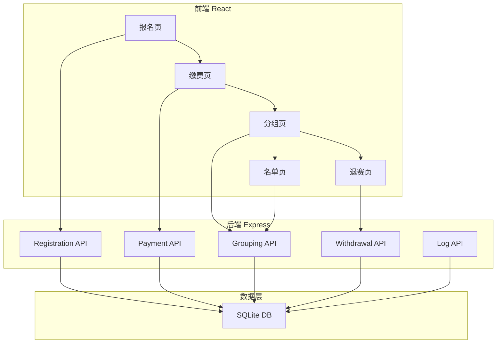
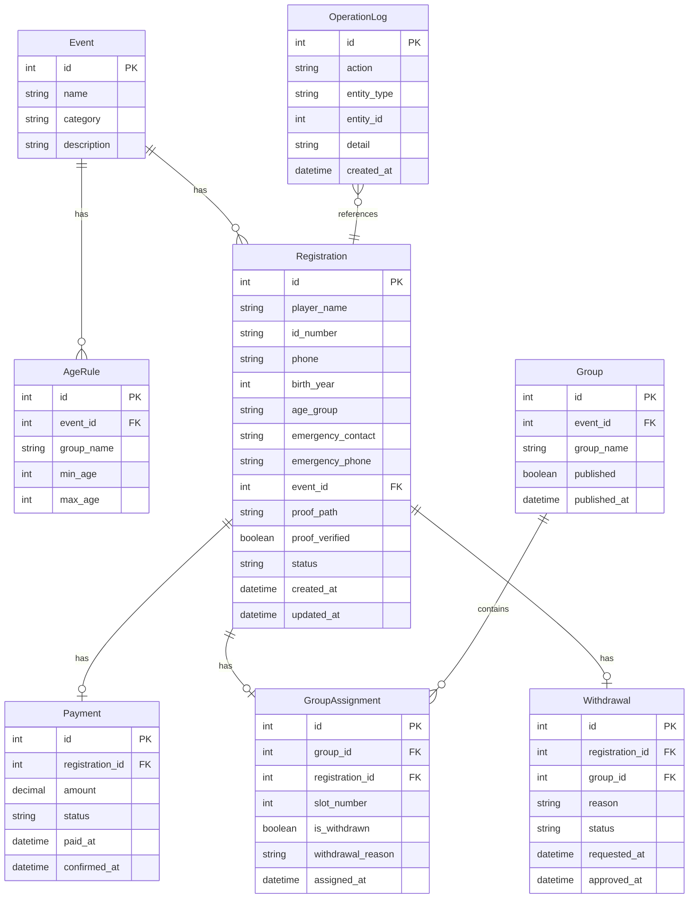

## 1. 架构设计



## 2. 技术说明

- 前端：React@18 + TailwindCSS@3 + Vite + Zustand + react-router-dom
- 初始化工具：vite-init
- 后端：Express@4 + TypeScript (ESM)
- 数据库：SQLite (better-sqlite3)
- 拖拽：@dnd-kit/core + @dnd-kit/sortable
- 文件上传：multer
- 容器化：Docker + docker-compose

## 3. 路由定义

| 路由 | 用途 |
|------|------|
| / | 首页仪表盘，赛事概览 |
| /register | 选手报名页 |
| /payment | 财务缴费页 |
| /grouping | 裁判长分组页 |
| /roster | 分组名单页 |
| /withdrawal | 退赛处理页 |

## 4. API 定义

### 4.1 报名 API

```
POST   /api/registrations          创建报名
GET    /api/registrations          查询报名列表
GET    /api/registrations/:id      查询报名详情
PUT    /api/registrations/:id      修改报名（改项目）
DELETE /api/registrations/:id      取消报名
POST   /api/registrations/:id/proof 上传参赛证明
```

### 4.2 缴费 API

```
GET    /api/payments/pending       查询待缴费列表
POST   /api/payments/:id/confirm   确认缴费
GET    /api/payments               查询缴费记录
```

### 4.3 分组 API

```
GET    /api/groupings/eligible     查询可入组选手（已缴费+合规）
POST   /api/groupings              保存分组结果
PUT    /api/groupings/:id          更新分组
POST   /api/groupings/publish      发布分组名单
GET    /api/groupings/published    查询已发布名单
```

### 4.4 退赛 API

```
POST   /api/withdrawals            提交退赛申请
GET    /api/withdrawals            查询退赛列表
PUT    /api/withdrawals/:id/approve 审批退赛
```

### 4.5 日志 API

```
GET    /api/logs                   查询操作日志
```

### 4.6 赛事配置 API

```
GET    /api/events                 查询赛事项目列表
GET    /api/events/:id/rules       查询项目年龄组规则
```

## 5. 服务端架构图


## 6. 数据模型

### 6.1 数据模型定义



### 6.2 数据定义语言

```sql
CREATE TABLE events (
    id INTEGER PRIMARY KEY AUTOINCREMENT,
    name TEXT NOT NULL,
    category TEXT NOT NULL,
    description TEXT
);

CREATE TABLE age_rules (
    id INTEGER PRIMARY KEY AUTOINCREMENT,
    event_id INTEGER NOT NULL REFERENCES events(id),
    group_name TEXT NOT NULL,
    min_age INTEGER NOT NULL,
    max_age INTEGER NOT NULL
);

CREATE TABLE registrations (
    id INTEGER PRIMARY KEY AUTOINCREMENT,
    player_name TEXT NOT NULL,
    id_number TEXT NOT NULL,
    phone TEXT,
    birth_year INTEGER NOT NULL,
    age_group TEXT,
    emergency_contact TEXT NOT NULL,
    emergency_phone TEXT NOT NULL,
    event_id INTEGER NOT NULL REFERENCES events(id),
    proof_path TEXT,
    proof_verified INTEGER DEFAULT 0,
    status TEXT DEFAULT 'pending' CHECK(status IN ('pending','paid','grouped','withdrawn','cancelled')),
    created_at DATETIME DEFAULT CURRENT_TIMESTAMP,
    updated_at DATETIME DEFAULT CURRENT_TIMESTAMP
);

CREATE UNIQUE INDEX idx_registrations_id_number_event ON registrations(id_number, event_id);

CREATE TABLE payments (
    id INTEGER PRIMARY KEY AUTOINCREMENT,
    registration_id INTEGER NOT NULL UNIQUE REFERENCES registrations(id),
    amount REAL NOT NULL,
    status TEXT DEFAULT 'pending' CHECK(status IN ('pending','confirmed','refunded')),
    paid_at DATETIME,
    confirmed_at DATETIME
);

CREATE TABLE groups (
    id INTEGER PRIMARY KEY AUTOINCREMENT,
    event_id INTEGER NOT NULL REFERENCES events(id),
    group_name TEXT NOT NULL,
    published INTEGER DEFAULT 0,
    published_at DATETIME
);

CREATE TABLE group_assignments (
    id INTEGER PRIMARY KEY AUTOINCREMENT,
    group_id INTEGER NOT NULL REFERENCES groups(id),
    registration_id INTEGER NOT NULL REFERENCES registrations(id),
    slot_number INTEGER,
    is_withdrawn INTEGER DEFAULT 0,
    withdrawal_reason TEXT,
    assigned_at DATETIME DEFAULT CURRENT_TIMESTAMP
);

CREATE TABLE withdrawals (
    id INTEGER PRIMARY KEY AUTOINCREMENT,
    registration_id INTEGER NOT NULL REFERENCES registrations(id),
    group_id INTEGER NOT NULL REFERENCES groups(id),
    reason TEXT NOT NULL,
    status TEXT DEFAULT 'pending' CHECK(status IN ('pending','approved','rejected')),
    requested_at DATETIME DEFAULT CURRENT_TIMESTAMP,
    approved_at DATETIME
);

CREATE TABLE operation_logs (
    id INTEGER PRIMARY KEY AUTOINCREMENT,
    action TEXT NOT NULL,
    entity_type TEXT NOT NULL,
    entity_id INTEGER,
    detail TEXT,
    created_at DATETIME DEFAULT CURRENT_TIMESTAMP
);
```
